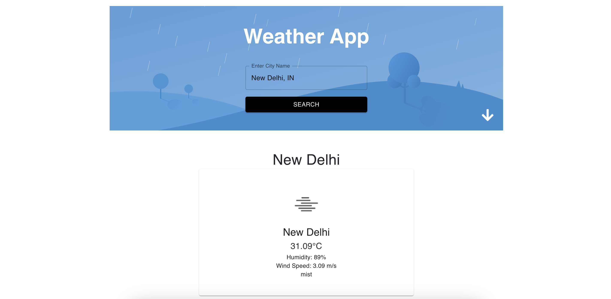
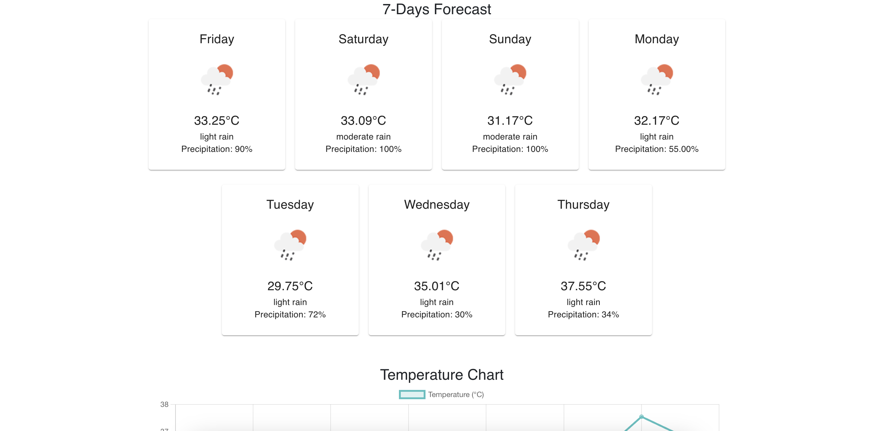

# Weather App

## Overview

The Weather App is a React application that allows users to search for weather information by city name. It displays current weather details and a 7-day forecast using data fetched from the OpenWeatherMap API.

## Features

- Search weather by city name
- Display current weather conditions
- Show 7-day weather forecast
- Save favorite cities for quick access
- Display weather alerts if available
- Localization support for different languages

## Components Overview

### App Component

- Manages state for inputCity, data, forecast, suggestions, error, favorites, language, and alerts.
- Fetches weather data from OpenWeatherMap API.
- Displays search input, current weather card, forecast cards, language selector, and alerts.

### Autocomplete Component

- Provides autocomplete suggestions for city names based on user input.
- Allows selecting cities for weather search.

### Forecast Component

- Displays 7-day weather forecast using forecast data fetched from the API.
- Each forecast card shows weather details for a specific day.

### Alerts Component

- Shows weather alerts if there are any for the selected city.

## Screenshots

### Home Page

### Forecast Page

## How to Run

1. **Clone Repository:**
   git clone https://github.com/your/"your-repo".git
   cd repo-name

## Install Dependencies:
npm install

## Set API Key:
Create a .env file in the root directory.
REACT_APP_API_KEY=your-api-key

## Run the Application:
npm start

## View the Application:
Open http://localhost:3000 in your browser.